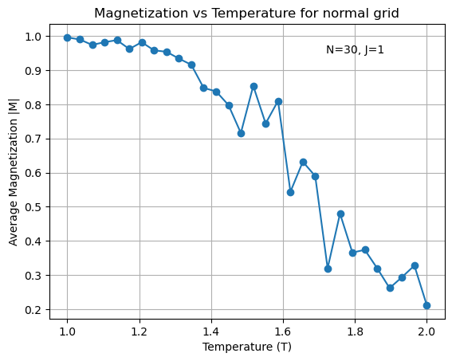
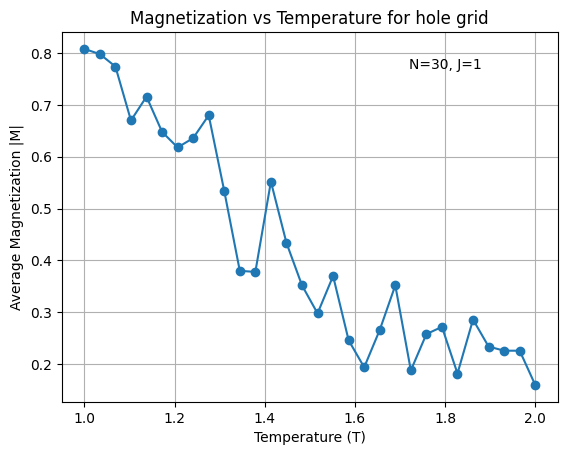
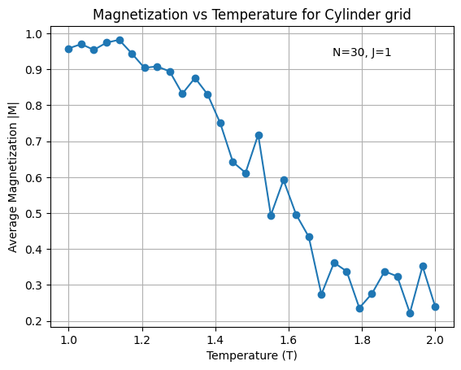
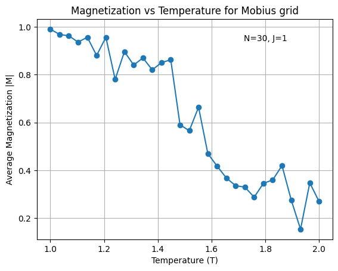
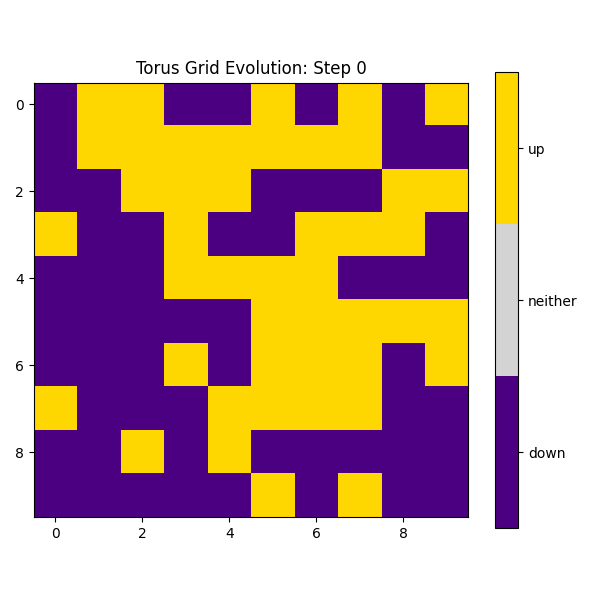
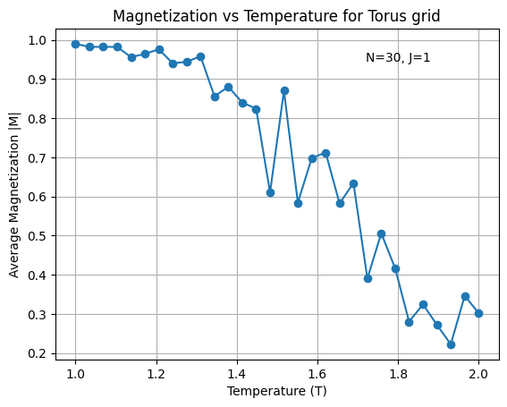

# comp_phy_final_project

This is the final project for the Computaional Phsyics (PHY329) Fall 2025.

# Authors:

- Nirron Miller
- Jason May
- Olivia Castillo

All exceptional physcists from the University of Texas at Austin 🤘🧡

# The Ising Model in Different Topologies and Couplings

## Project Description

This project simulates the **classical Ising model**, a widely used toy model for studying interacting and coupled systems in statistical physics. We will investigate how the **net magnetization** of the Ising model changes across **different topologies** and **coupling strengths** (representing ferromagnetism), as a function of **temperature** and **interaction strength**.

---

## Planned Directory Structure
# ising_model.py
Main Ising model class (classical and/or quantum):
- Methods for magnetization
- Visual aids
- Overridden update rules
- Simulation initialization
# grid.py 
Grid class and topology definitions:
- Update rules
- Grid initialization methods
#demo.ipynb 
- All simulations and visual results (graphs, grids, etc.)
# README.md 
- Summary of results and background research

---

## Planned Steps

1. **Simulate** the classical Ising model using the **Metropolis update rule** on a 2D grid (implemented in NumPy).  
   Example steps:
   - Pick a spin site and compute its energy contribution.
   - Flip the spin and calculate the new contribution.
   - Accept the flip if energy decreases; otherwise accept with probability \( e^{-\Delta E / kT} \).
   - Repeat for all spins until equilibrium.

2. **Measure magnetization** of the final grid using different statistical methods.

3. **Introduce different topologies** (e.g., holes, modified boundaries) and repeat simulations to compare how topology affects magnetization.

4. **Run statistical tests** on the results to quantify differences between topologies and coupling parameters.

5. **(Optional Extension)**: Implement a **Quantum Ising Model** — the *Transverse-Field Ising Model (TFIM)* — to explore quantum effects on magnetization and phase transitions.

---

## 👥 Team Contributions

- **Jason** — Run simulations, develop graphs of net magnetization vs. system parameters, and perform statistical analyses to quantify effects of topology and coupling.
- **Nir** — Build the `ising_model.py` and `grid.py` classes, implement update rules and initialization logic.
- **Olivia** — Develop visual simulations (images, animations, and videos), and handle code documentation and presentation.

---

## Methods & Planned Analyses

### Core Model
- Classical Ising model using the **Metropolis algorithm** and **NumPy**
- Parameters:
  - Temperature \( T \)
  - Coupling constant \( J \) (ferromagnetic strength)

### Statistical Quantities
- **Net magnetization**
- **Magnetization as a function of temperature and coupling**
- **Phase transition analysis**: identify Tc where spontaneous magnetization disappears.

### Research Questions
- How does **net magnetization** change under different **topologies**?
- How does it behave in the **quantum model (TFIM)**?
- How does magnetization differ across **dimensionalities**?
---

## 🔗 References and Resources

- [Lecture Notes on the Ising Model – Peking University](https://www.math.pku.edu.cn/teachers/litj/notes/appl_stoch/lect7.pdf)  
- [Wikipedia: Transverse-Field Ising Model](https://en.wikipedia.org/wiki/Transverse-field_Ising_model)  
- [arXiv:2009.09208 — Transverse-Field Ising Model](https://arxiv.org/abs/2009.09208)

---

## Summary

We aim to:
- Simulate the **classical Ising model** with various **couplings and topologies**  
- Quantify how **magnetization** depends on **temperature**, **geometry**, and **interaction strength**  
- Optionally extend to a **quantum model (TFIM)** to compare classical vs. quantum behavior  

The project’s goal is to understand how **geometry and quantum effects** influence **collective magnetic order** and **phase transitions** in coupled spin systems.

---

# Project Results

The Ising model was implemented using several different lattice topologies: None (open boundaries), Hole, Cylinder, Möbius Strip, and Torus. Below, we present video results and plots of temperature versus magnetization. We also identify the critical temperature observed in each topology.

## Normal Grid

Video of the evolution of the Ising Model on a normal grid with temperature = 1 K and a couplig constant of .1:

## Hole Grid

This topology involved adding a hole to our lattice. 

## Cylinder Grid

## Mobius Grid

## Torus Grid
