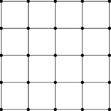
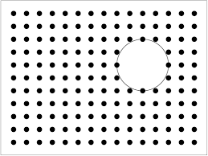
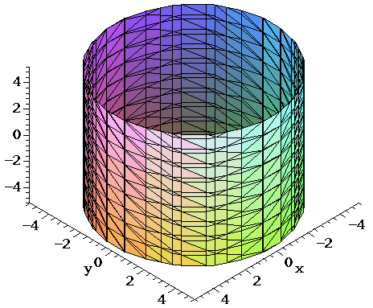
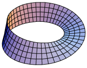

# comp_phy_final_project

This is the final project for the Computaional Phsyics (PHY329) Fall 2025.

# Authors:

- Nirron Miller
- Jason May
- Olivia Castillo

All exceptional physcists from the University of Texas at Austin 🤘🧡

# The Ising Model in Different Topologies and Couplings

## Project Description

This project simulates the **classical Ising model**, a widely used toy model for studying interacting and coupled systems in statistical physics. We will investigate how the **net magnetization** of the Ising model changes across **different topologies** and **coupling strengths** (representing ferromagnetism), as a function of **temperature** and **interaction strength**.

---

## Planned Directory Structure
# ising_model.py
Main Ising model class (classical and/or quantum):
- Methods for magnetization
- Visual aids
- Overridden update rules
- Simulation initialization
# grid.py 
Grid class and topology definitions:
- Update rules
- Grid initialization methods
#demo.ipynb 
- All simulations and visual results (graphs, grids, etc.)
# README.md 
- Summary of results and background research

---

## Planned Steps

1. **Simulate** the classical Ising model using the **Metropolis update rule** on a 2D grid (implemented in NumPy).  
   Example steps:
   - Pick a spin site and compute its energy contribution.
   - Flip the spin and calculate the new contribution.
   - Accept the flip if energy decreases; otherwise accept with probability \( e^{-\Delta E / kT} \).
   - Repeat for all spins until equilibrium.

2. **Measure magnetization** of the final grid using different statistical methods.

3. **Introduce different topologies** (e.g., holes, modified boundaries) and repeat simulations to compare how topology affects magnetization.

4. **Run statistical tests** on the results to quantify differences between topologies and coupling parameters.

5. **(Optional Extension)**: Implement a **Quantum Ising Model** — the *Transverse-Field Ising Model (TFIM)* — to explore quantum effects on magnetization and phase transitions.

---

## 👥 Team Contributions

- **Jason** — Run simulations, develop graphs of net magnetization vs. system parameters, and perform statistical analyses to quantify effects of topology and coupling.
- **Nir** — Build the `ising_model.py` and `grid.py` classes, implement update rules and initialization logic.
- **Olivia** — Develop visual simulations (images, animations, and videos), and handle code documentation and presentation.

---

## Methods & Planned Analyses

### Core Model
- Classical Ising model using the **Metropolis algorithm** and **NumPy**
- Parameters:
  - Temperature \( T \)
  - Coupling constant \( J \) (ferromagnetic strength)

### Statistical Quantities
- **Net magnetization**
- **Magnetization as a function of temperature and coupling**
- **Phase transition analysis**: identify Tc where spontaneous magnetization disappears.

### Research Questions
- How does **net magnetization** change under different **topologies**?
- How does it behave in the **quantum model (TFIM)**?
- How does magnetization differ across **dimensionalities**?
---

## 🔗 References and Resources

- [Lecture Notes on the Ising Model – Peking University](https://www.math.pku.edu.cn/teachers/litj/notes/appl_stoch/lect7.pdf)  
- [Wikipedia: Transverse-Field Ising Model](https://en.wikipedia.org/wiki/Transverse-field_Ising_model)  
- [arXiv:2009.09208 — Transverse-Field Ising Model](https://arxiv.org/abs/2009.09208)

---

## Summary

We accomplished :
- Simulate the **classical Ising model** with various **couplings and topologies**  
- Quantify how **magnetization** depends on **temperature**, **geometry**, and **interaction strength**  
- Added a Tranverse Field (Quantum) Ising Model and magnetization observables

The project’s goal is to understand how **geometry and quantum effects** influence **collective magnetic order** and **phase transitions** in coupled spin systems.

---

# Background

The classic spin Ising model is a popular toy model for many physical and stastical phenomena, with wide range usage in physics, stastics, optimization, quantum computing, material science, and more. 

The Hamilitonian for the Ising model is given by:

J defines the coupling strength between local spins and h is the external magnetic strength. 

A NxN grid (theoritically N is infinite) is initalized with randomly selected spinning points. The points can either spin up or down. In the classic model, the points are electrons, with some dipole moment. 

The global aggregation of spins determine the overall "magnetization" of the spin system, which measures the net spin direction of the system. Locally spins may alter one another following the Metropolis algorithm. 

## Metropolis Rule: 

The Metropolis update rule provokes groups of uniformly spinning points to alter nearby points with opposite spins. Per update iteration a point is randomly selected within the grid. Then the local energy is sampled between the four adjacent points near the selected point. If the overall energy of changing the selected spin is less then the current energy of the state, then the point flips its spin. Otherwise, the points flips according to a Boltzmann probability distrubtion.  

Where 

and 

The (T) refers to temperature, which is a parameter that can be inputted into our model. 
---
# How to run

1.) Run pip install -r req.txt to install all packages. Make sure for all notebooks to press restart then Run All. 

2.) There are several notebooks to explore. Go to the demo.ipynb to run the basic simulation (no visualizations) for the quantum ising model and topological classical ising model.

3.) Run stats_n_graphs.ipynb to run magnetization vs temperature graphs/ tests

4.) demo_animations.ipynb to download cool animations for the topological ising models.

# Project Results

The Ising model was implemented using several different lattice topologies: None (open boundaries), Hole, Cylinder, Möbius Strip, and Torus. Below, we present video results and plots of temperature versus magnetization. We also identify the critical temperature observed in each topology.

## Normal Grid

Video of the evolution of the Ising Model on a normal grid with temperature = 1 K and a couplig constant of .1:

## Hole Grid

This topology involved adding a hole to our lattice. 

## Cylinder Grid

## Mobius Grid

## Torus Grid

